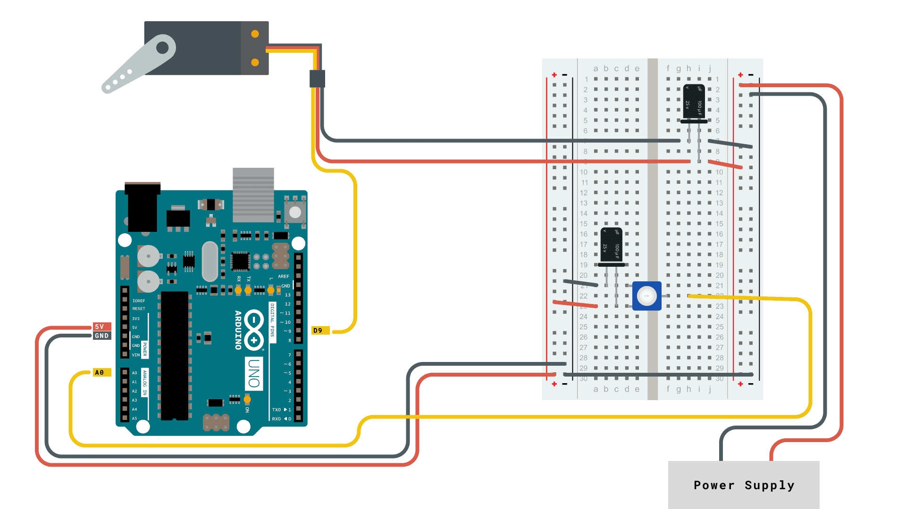

# Hexapod
<!---Replace this text with a brief description (2-3 sentences) of your project. This description should draw the reader in and make them interested in what you've built. You can include what the biggest challenges, takeaways, and triumphs from completing the project were. As you complete your portfolio, remember your audience is less familiar than you are with all that your project entails!-->

<!--- This is an HTML comment in Markdown -->
<!--- Anything between these symbols will not render on the published site -->


| **Engineer** | **School** | **Area of Interest** | **Grade** |
|:--:|:--:|:--:|:--:|
| Alex V. | Saratoga High School | Electrical and Computer Engineering | Incoming Senior


-->
# Final Milestone

For my final milestone, I made my modifications, which are an LED matrix that can display text and a case for the LED matrix and battery. First I had to figure out how to wire an LED matrix to an Arduino board. I researched it for a while and found a lot of different ways, but I eventually figured it out. On top of this being a significant obstacle, I also learned a lot about Arduino boards. Next, I found a Arduino library made for the purpose of controllin


For your final milestone, explain the outcome of your project. Key details to include are:
- What you've accomplished since your previous milestone
- What your biggest challenges and triumphs were at BSE
- A summary of key topics you learned about
- What you hope to learn in the future after everything you've learned at BSE

# Third Milestone

<iframe width="560" height="315" src="https://www.youtube.com/embed/kW4szmZXZyE?si=4xAk0ti6wxZ0jL2d" title="YouTube video player" frameborder="0" allow="accelerometer; autoplay; clipboard-write; encrypted-media; gyroscope; picture-in-picture; web-share" referrerpolicy="strict-origin-when-cross-origin" allowfullscreen></iframe>

For my third milestone, I built the remote controller and connected it to the hexapod. Building the controller was simple and involved screwing an Arduino board with a control shield onto a base, onto which I screwed on a battery case. This holds a 9V battery that powers the controller Arduino. I then put WLAN modules on the hexapod and the controller, which were linked and allowed the controller to wirelessly control the hexapod. Controlling the hexapod using the remote controller is much easier than using the Processing sketch. The hexapod responds much more quickly to inputs and works more reliably. The controller can be put into several different "modes" by flipping three switches on the controller board into different combinations. For example, there is a mode where the joystick only controls the direction in which the hexapod moves, while another allows the joystick to turn the hexapod as well as moveing it.

# Second Milestone

<iframe width="560" height="315" src="https://www.youtube.com/embed/fgWmVoJPao0?si=CvSVnkKDithFHTtB" title="YouTube video player" frameborder="0" allow="accelerometer; autoplay; clipboard-write; encrypted-media; gyroscope; picture-in-picture; web-share" referrerpolicy="strict-origin-when-cross-origin" allowfullscreen></iframe>

My second milestone involved connecting to my hexapod with my computer and calibrating the servos. I had to place the hexapod on top of a calibration diagram showing where the legs should be in neutral position. The two front legs of my hexapod were too far forward, so I had to reattach them by unscrewing and screwing back on the top servos at a different angle. 

# First Milestone

<iframe width="560" height="315" src="https://www.youtube.com/embed/CjzWhx63Bdg?si=_pPeSyFteW1XCkPI" title="YouTube video player" frameborder="0" allow="accelerometer; autoplay; clipboard-write; encrypted-media; gyroscope; picture-in-picture; web-share" referrerpolicy="strict-origin-when-cross-origin" allowfullscreen></iframe>

For my first milestone, I assembled my hexapod. This includes acrylic parts, a control board, servos, and a battery. I encountered a lot of challenges while completiong this mileston. Attaching the servo arms to the acrylic parts was tedious and difficult. I often had to redo parts of the building process that I didn't realize I had gotten wrong. The wiring was also a long process, since I spent a considerable amount of time wiring the servos neatly only to later have to rearrange the connections. Next I will connect the hexapod to my computer using the Processing app and calibrate the hexapod. I will probably have to reattach some servos unless the testing goes right the first time.


<!---# Schematics 


# Code
Here's where you'll put your code. The syntax below places it into a block of code. Follow the guide [here]([url](https://www.markdownguide.org/extended-syntax/)) to learn how to customize it to your project needs. 

```c++
void setup() {
  // put your setup code here, to run once:
  Serial.begin(9600);
  Serial.println("Hello World!");
}

void loop() {
  // put your main code here, to run repeatedly:

}
```-->


# Bill of Materials

| **Part** | **Note** | **Price** | **Link** |
|:--:|:--:|:--:|:--:|
| Arduino Mega | Hexapod control board | $Price | <a href="https://www.amazon.com/Arduino-A000066-ARDUINO-UNO-R3/dp/B008GRTSV6/"> Link </a> |
| WLAN Module | What the item is used for | $Price | <a href="https://www.amazon.com/Arduino-A000066-ARDUINO-UNO-R3/dp/B008GRTSV6/"> Link </a> |
| Item Name | What the item is used for | $Price | <a href="https://www.amazon.com/Arduino-A000066-ARDUINO-UNO-R3/dp/B008GRTSV6/"> Link </a> |


<!---# Other Resources/Examples
One of the best parts about Github is that you can view how other people set up their own work. Here are some past BSE portfolios that are awesome examples. You can view how they set up their portfolio, and you can view their index.md files to understand how they implemented different portfolio components.
- [Example 1](https://trashytuber.github.io/YimingJiaBlueStamp/)
- [Example 2](https://sviatil0.github.io/Sviatoslav_BSE/)
- [Example 3](https://arneshkumar.github.io/arneshbluestamp/)

To watch the BSE tutorial on how to create a portfolio, click here.-->


# Starter Project



<iframe width="560" height="315" src="https://www.youtube.com/embed/NnEI5BXkU1Q?si=BD2qRiPSHRPxkvwb" title="YouTube video player" frameborder="0" allow="accelerometer; autoplay; clipboard-write; encrypted-media; gyroscope; picture-in-picture; web-share" referrerpolicy="strict-origin-when-cross-origin" allowfullscreen></iframe>

My starter project was a simple circuit with the input device as a potentiometer and the output device as a servo. I wired the potentiometer to the power and ground of the arduino board while the servo's power came from batteries. I wired the potentiometer to an analog input on the arduino, which converts the analog (0 to 1023) input into a value from 0 to 180. This value is relayed to the servo through a wire. 

